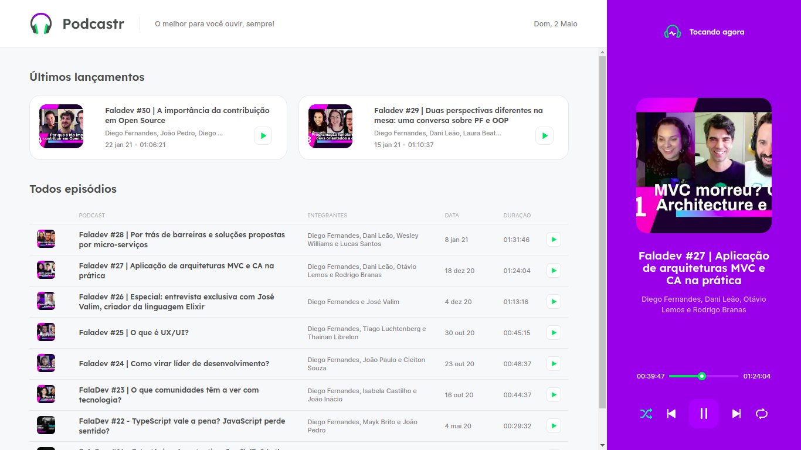
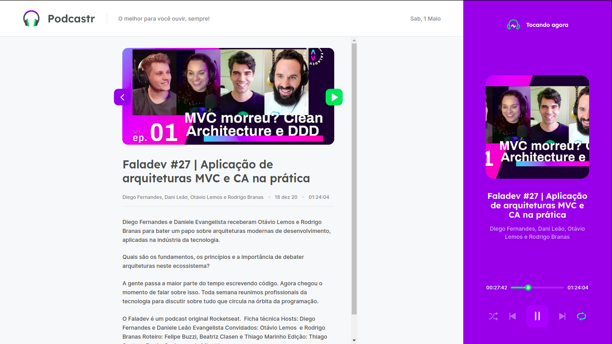

<p align="center">
  <h3 align="center">Podcastr</h3>

  <p align="center">
    An app made to listen to podcasts in a easy way.
    <br />
    <a href="https://github.com/lucfersan/podcastr-nlw5"><strong>Explore the docs »</strong></a>
    <br />
    <br />
    ·
    <a href="https://github.com/lucfersan/podcastr-nlw5/issues">Report Bug</a>
    ·
    <a href="https://github.com/lucfersan/podcastr-nlw5/issues">Request Feature</a>
  </p>
</p>

## 📚 About The Project


This is an app build in the Next Level Week 5, made by [@Rocketseat](https://github.com/Rocketseat).

I chose the React track because I wanted to solidify my knowledge in this technology and learn new concepts that I can apply in my projects.

To connect to an api, this app uses the lib json-server to create a fictitious server in order to focus only on the React library.

### 🛠️ Built With

- [Next.js](https://nextjs.org/)
- [React Context API](https://reactjs.org/docs/context.html)
- [Typescript](https://www.typescriptlang.org/)
- [Sass](https://sass-lang.com/)
- [Json-Server](https://github.com/typicode/json-server)

### 💻 Installation

1. Clone the repo
   ```sh
   git clone https://github.com/lucfersan/podcastr-nlw5.git
   ```
2. Install the packages
   ```sh
   cd podcastr-nlw5
   yarn
   ```

### 🚀 Run locally

1. Start the json server
   ```sh
   yarn server
   ```
2. Start the next server
   ```sh
   yarn dev
   ```
3. Open your browser on localhost:3000

## 🎮 Usage

<p float="left">
  
   
</p>

## 🤝 Contributing

Contributions are what make the open source community such an amazing place to be learn, inspire, and create. Any contributions you make are **greatly appreciated**.

1. Fork the Project
2. Create your Feature Branch (`git checkout -b feature/AmazingFeature`)
3. Commit your Changes (`git commit -m 'Add some AmazingFeature'`)
4. Push to the Branch (`git push origin feature/AmazingFeature`)
5. Open a Pull Request

## 🗞️ License

Distributed under the MIT License. See `LICENSE` for more information.

## 📬 Contact

Lucas Fernandes - fernandes.lucas11@outlook.com

### 😄 Special thanks to

- [Diego Fernandes](https://github.com/diego3g)
- [Rocketseat](https://github.com/Rocketseat)
